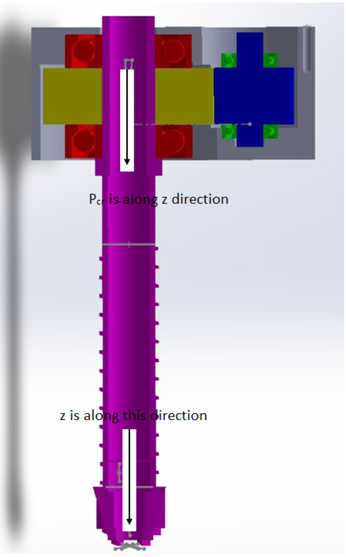

# 🌕 Lunar Regolith Drilling Mechanism (SSM-153)
## 🔩 Drill Mechanism

## 📌 Overview
Design and analysis of a **lunar drilling mechanism** for regolith sampling in permanently shadowed regions (PSRs).  
The system focuses on **robust operation under extreme lunar conditions** and supports future **in-situ resource utilization (ISRU)** missions.

**Course:** Spacecraft Structures and Mechanisms  
**University:** Università di Pisa  

---

## 🎯 Objectives
- Extract lunar regolith up to **1 meter depth**  
- Operate in **extreme temperature, vacuum, and dust**  
- Ensure **high reliability and structural integrity**  

---

## 🌑 Lunar Environment Challenges
- 🌡️ Temperature: +150°C to −200°C  
- 🌪️ Abrasive, electrostatic dust  
- ☢️ High radiation exposure  
- 🌌 Vacuum conditions  

---

## ⚙️ System Design

### 🔩 Mechanism
- Rotary auger drilling system  
- Capstan-based feed mechanism  
- Planetary gear train for speed reduction  

### ⚡ Key Parameters
- Auger speed: **200 rpm**  
- Motor speed: **8000 rpm → reduced to 400 rpm**  
- Torque: **~10–12 Nm**  
- Penetration force: **~150 N**  

---

## 🛠️ Components
- Planetary gear system  
- Self-aligning bearings (SKF)  
- Dry lubrication (MoS₂ coating)  
- Tungsten Carbide drill bit  
- Titanium alloy auger (Ti–5Al–2.5Sn)  

---

## 🧪 Analysis Performed
- Compression & tension stress  
- Torsion analysis  
- Buckling analysis  
- Modal analysis  

### ✅ Key Results
- High factor of safety (>1000 in axial loading)  
- Max shear stress << material limits  
- Safe operating frequency (no resonance at 200 rpm)  

---

## 🧠 Design Insights
- Dry lubrication required due to vacuum  
- Dust mitigation via seals & coatings  
- Thermal-resistant materials critical  
- Gear reduction ensures optimal torque-speed balance  

---

## 🧰 Tools Used
- **CAD Modeling:** CATIA  
- **Simulation:** ANSYS  
- **Analysis:** MATLAB   

---

## 🚀 Applications
- Lunar ISRU missions  
- Planetary exploration systems  
- Autonomous drilling technologies  

---

## 🔮 Future Work
- Dynamic analysis of drilling system  
- Experimental validation  
- Percussion mechanism design  
- Dust mitigation advancements 
